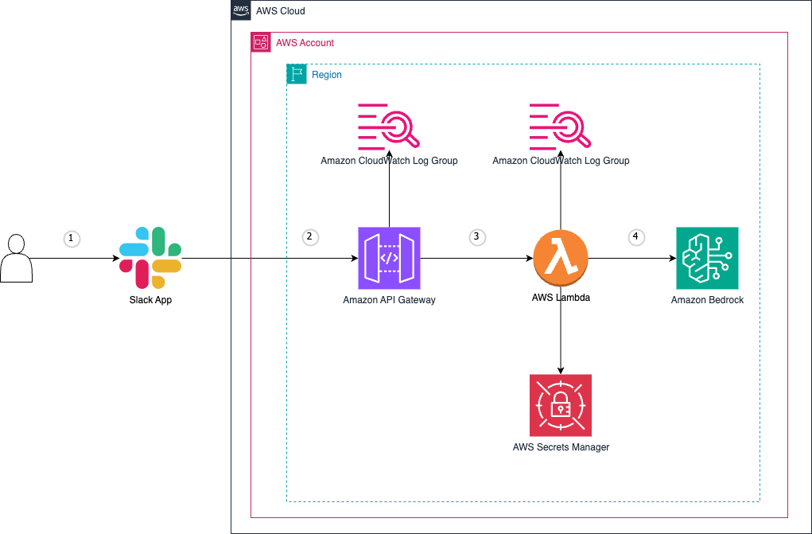
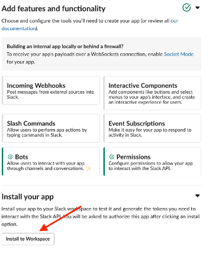
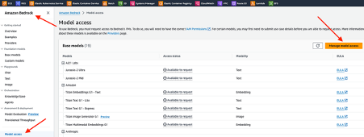
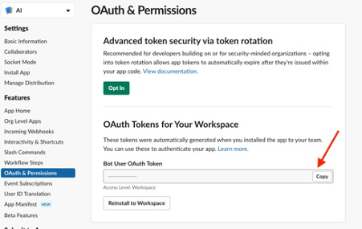
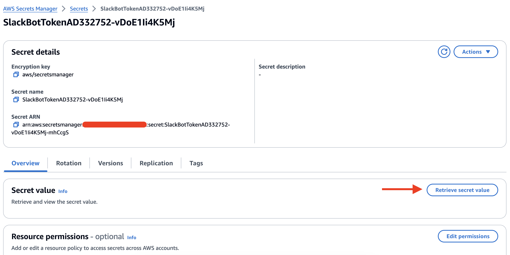
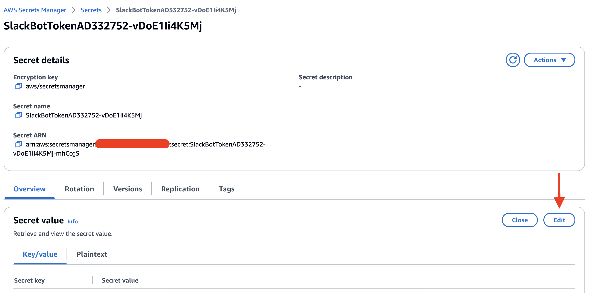
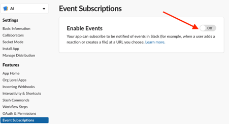
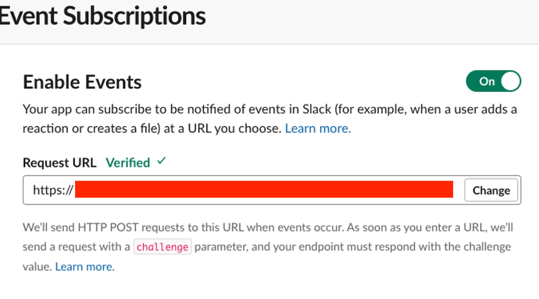
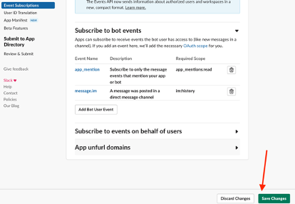

# Slack Gateway for Amazon Bedrock

In this repo we share a project which lets you use Amazon Bedrock's generative AI to enable Slack channel members to access your organizations data and knowledge sources via conversational question-answering. You can connect to your organization data via data source connectors and integrate it with Slack Gateway for Amazon Bedrock to enable access to your Slack channel members. It allows your users to:

- Converse with Amazon Bedrock using Slack Direct Message (DM) to ask questions and get answers based on company data, get help creating new content such as emails, and performing tasks. 
- You can also invite it to participate in your team channels. 
  - In a channel users can ask it questions in a new message, or tag it in a thread at any point. Get it to provide additional data points, resolve a debate, or summarize the conversation and capture next steps. 

It's easy to deploy in your own AWS Account, and add to your own Slack Workspace. We show you how below.

### Features
- In DMs it responds to all messages
- In channels it responds only to @mentions
- Aware of conversation context - it tracks the conversation and applies context
- Aware of multiple users - when it's tagged in a thread, it knows who said what, and when - so it can contribute in context and accurately summarize the thread when asked.

This sample Amazon Bedrock slack application is provided as open source — use it as a starting point for your own solution, and help us make it better by contributing back fixes and features via GitHub pull requests. Explore the code, choose Watch to be notified of new releases, and check back for the latest  updates.

## Architecture



1. The user communicates with the Slack application.
2. The Slack applications sends the event to the Amazon API Gateway used in the Event Subscription.
3. The Amazon API Gateway forwards the event to the Lambda Function.
4. The Lambda Function invokes Amazon Bedrock with the request, then responds to the user in Slack.

## Deploy the solution

### Prerequisites

You need to have an AWS account and an IAM Role/User with permissions to create and manage the necessary resources and components for this application. *(If you do not have an AWS account, please see [How do I create and activate a new Amazon Web Services account?](https://aws.amazon.com/premiumsupport/knowledge-center/create-and-activate-aws-account/))*


### 1. Create your Slack app

Create a Slack app: https://api.slack.com/apps from the [app manifest](./slack-app-manifest.yaml) - copy / paste the contents as YAML.

Once the App is created, install your app.



### 2. Enable Amazon Bedrock Model Access

You can choose model of your choice from available list. Refer to more documentation of [getting Amazon Bedrock access](https://docs.aws.amazon.com/bedrock/latest/userguide/model-access.html).



### 3. Deploy the stack

Get temporary access keys to the account to deploy the stack.

```
export AWS_ACCESS_KEY_ID="..."
export AWS_SECRET_ACCESS_KEY="..."
```

If you would like to change the name of the stack, set the environment variable.

```
export SLACK_NAME="my-stack-name"
```

Now install this project's dependencies, bootstrap the account, and deploy the stack to your account.

```
npm ci
npx cdk bootstrap
npx projen deploy
```

### 4. Update Secret with Slack Token


We need the Slack Bot token and will use it. Please copy this token and save it.



When your CloudFormation stack status is CREATE_COMPLETE, choose the **Outputs** tab, and click URL from SlackBotTokenOutput.


Update the secret and update it with the Slack Bot token.




### 5. Configure your Slack application

Navigate again to the choose the **Outputs** tab, and copy URL from SlackBotEndpointOutput and return to Slack, where we will add it to event subscriptions.

Navigate to Event subscriptions and turn event subscriptions on.



The event subscription should get automatically verified.



Scroll down, select Subscribe to bot events, and select the app_mention and message.im. Save Changes.



### Say hello
> Time to say Hi!

1. Go to Slack
2. Under Apps > Manage, add your new Amazon Bedrock app
3. Optionally add your app to team channels
4. In the app DM channel, say *Hello*. In a team channel, ask it for help with an @mention.
5. Enjoy.

## Contributing, and reporting issues

We welcome your contributions to our project. Whether it's a bug report, new feature, correction, or additional
documentation, we greatly value feedback and contributions from our community.

See [CONTRIBUTING](CONTRIBUTING.md) for more information.

## Security

See [Security issue notifications](CONTRIBUTING.md#security-issue-notifications) for more information.

## License

This library is licensed under the MIT-0 License. See the [LICENSE](./LICENSE) file.
